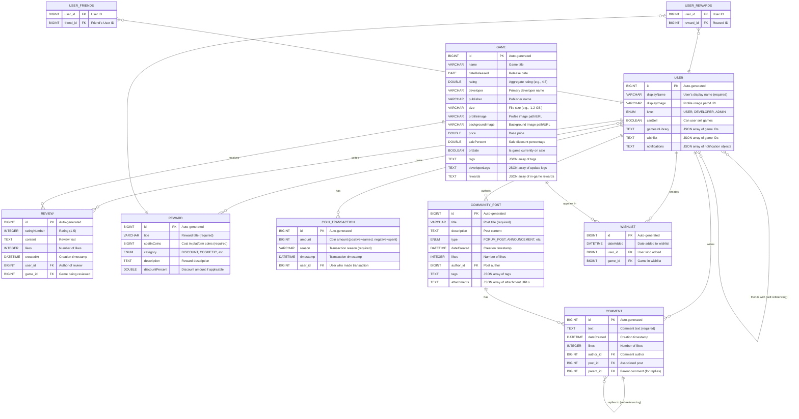

# P3 Fleet Gaming Platform - Database ERD

## Entity Relationship Diagram

This ERD shows the complete database schema for the Fleet Gaming Platform backend.



## Relationship Details

### One-to-Many Relationships

| Parent Entity | Child Entity | Description | Foreign Key |
|--------------|--------------|-------------|-------------|
| **User** | Review | A user can write multiple reviews | `user_id` in Review |
| **User** | CoinTransaction | A user has multiple coin transactions | `user_id` in CoinTransaction |
| **User** | CommunityPost | A user can author multiple posts | `author_id` in CommunityPost |
| **User** | Comment | A user can write multiple comments | `author_id` in Comment |
| **User** | Wishlist | A user can have multiple wishlist entries | `user_id` in Wishlist |
| **Game** | Review | A game can have multiple reviews | `game_id` in Review |
| **Game** | Wishlist | A game can appear in multiple wishlists | `game_id` in Wishlist |
| **CommunityPost** | Comment | A post can have multiple comments | `post_id` in Comment |
| **Comment** | Comment | A comment can have multiple replies (self-referencing) | `parent_id` in Comment |

### Many-to-Many Relationships

| Entity 1 | Entity 2 | Join Table | Description |
|----------|----------|------------|-------------|
| **User** | **Reward** | `user_rewards` | Users can own multiple rewards, rewards can be owned by multiple users |
| **User** | **User** | `user_friends` | Self-referencing friendship relationship |

### Unique Constraints

- **Review**: `(user_id, game_id)` - One review per user per game
- **Wishlist**: Implicitly unique by design - one entry per user-game combination

### JSON/JSONB Fields

#### User JSON Fields
- `gamesInLibrary`: Array of game IDs the user owns
- `wishlist`: Array of game IDs (note: also tracked in Wishlist table for metadata)
- `notifications`: Array of notification objects

#### Game JSON Fields
- `tags`: Array of tag strings (e.g., `["Action", "RPG", "Multiplayer"]`)
- `developerLogs`: Array of update objects (e.g., `[{"title": "v1.1", "description": "Bug fixes"}]`)
- `rewards`: Array of in-game reward objects (e.g., `[{"id": 1, "title": "Gold Skin", "cost": 500}]`)

#### CommunityPost JSON Fields
- `tags`: Array of tag strings
- `attachments`: Array of attachment URLs (images, videos, screenshots)

## Enums

### UserLevel
```java
enum UserLevel {
    USER,
    DEVELOPER,
    ADMIN
}
```

### RewardCategory
```java
enum RewardCategory {
    DISCOUNT,
    COSMETIC,
    // ... other categories
}
```

### PostType
```java
enum PostType {
    FORUM_POST,
    ANNOUNCEMENT,
    // ... other types
}
```

## Cascade Behaviors

- **User → CommunityPost**: CASCADE ALL
- **User → Review**: No cascade (reviews remain if user deleted)
- **CommunityPost → Comment**: CASCADE ALL with ORPHAN REMOVAL
- **Comment → Comment (replies)**: CASCADE ALL

## Indexes (Recommended)

For optimal performance, consider these indexes:

```sql
-- User lookups
CREATE INDEX idx_user_displayname ON users(displayName);

-- Game searches
CREATE INDEX idx_game_developer ON games(developer);
CREATE INDEX idx_game_onsale ON games(onSale);
CREATE INDEX idx_game_rating ON games(rating);

-- Review queries
CREATE INDEX idx_review_game ON reviews(game_id);
CREATE INDEX idx_review_user ON reviews(user_id);
CREATE INDEX idx_review_rating ON reviews(ratingNumber);

-- Community features
CREATE INDEX idx_post_author ON community_posts(author_id);
CREATE INDEX idx_post_type ON community_posts(type);
CREATE INDEX idx_comment_post ON comments(post_id);
CREATE INDEX idx_comment_parent ON comments(parent_id);

-- Wishlist lookups
CREATE INDEX idx_wishlist_user ON wishlists(user_id);
CREATE INDEX idx_wishlist_game ON wishlists(game_id);

-- Transactions
CREATE INDEX idx_transaction_user ON coin_transactions(user_id);
CREATE INDEX idx_transaction_timestamp ON coin_transactions(timestamp);
```

## Database Statistics

Based on seeded data:

| Entity | Seeded Records | Notes |
|--------|---------------|-------|
| Users | 2 | Neon_Architect (Developer), Alpha_Tester (User) |
| Games | 1 | Cyber Protocol |
| Reviews | 1 | Alpha_Tester's review of Cyber Protocol |
| Rewards | 1 | 10% Store Discount |
| CoinTransactions | 1 | Alpha_Tester's signup bonus |
| CommunityPosts | 1 | Help request post |
| Comments | 2 | Main comment + 1 reply |
| Friendships | 1 | Neon_Architect ↔ Alpha_Tester |

## Technology Stack

- **ORM**: Hibernate/JPA
- **Database**: PostgreSQL
- **JSON Handling**: Jackson with custom JsonConverter
- **Validation**: Jakarta Validation
- **Annotations**: Lombok for boilerplate reduction

---

**Last Updated**: January 2026
**Version**: 1.0
**Project**: P3 Fleet Gaming Platform
